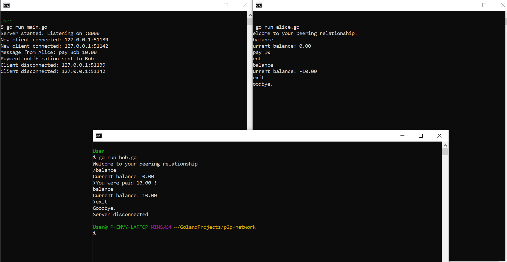

# P2P Payment Network

## Overview

**`P2P Payment Network` is a simple peer-to-peer payment system implemented in `Go` It allows users (clients) to send
payments to each other while maintaining account balances. Each user runs the program independently on their machine and
interacts through a Command Line Interface `CLI`.
The balances are maintained locally on each user's instance without remote storage, ensuring decentralized tracking.**

## Features

- **Interactive CLI:** Users can send payments and check their balances via a simple command-line interface.
- **TCP-based Communication:**  Peers communicate over a network connection to exchange payment information.
- **Real-time Messaging:**  Users receive notifications when a payment is made.
- **Decentralized Tracking:**  Each user maintains their own balance independently, ensuring no centralized state
  management.
- **No Persistent Storage:**  Peers communicate over a network connection to exchange payment information.Peers
  communicate over a network connection to exchange payment information.

## Technologies Used

- Go (Golang) - Main programming language.
- TCP Sockets - Communication between clients and server.

## Getting Started

### Prerequisites

- GO 1.20 or higher.

### Installation & Setup

1. **Clone the project**  
   Run the following command to clone the project from repository:
   ```sh
   git clone https://github.com/yourusername/p2p-network.git

2. **Navigate to the project directory**
   ```sh
   cd p2p-network

3. **Start the Peer-to-Peer Server:**
   ```sh
   go run main.go

4. **Start Clients (Alice & Bob):**  
   Open a new terminal and start Alice:
   ```sh
   go run alice.go
   ```

   Open another terminal and start Bob:
   ```sh
   go run bob.go
   ```

### Usage

**Interacting with the CLI**  
Each user can use the following commands within their interactive prompt:

- **Check Balance:**
  <br>Displays the current account balance.
    ```sh
    balance
    ```
- **Send Money:**
  <br>Sends the specified amount to the other user.
    ```sh
    pay <amount>
    ```
- **Exit the CLI:**
  <br>Disconnects client from the server.
    ```sh
    exit
    ```

- **Example of interaction:**
  <br>Terminal 1: Alice:
   ```sh
  Welcome to your peering relationship!
  > balance
  0.00
  > pay 10
  Sent
  > balance
  -10  # (Bob's balance is now 10)
  > exit
  Goodbye.  
   ```
  Terminal 2: Bob:
   ```sh
  Welcome to your peering relationship!
  > balance
  0
  You were paid 10.00 !
  > balance
  10.00
  > exit
  Goodbye.
  ```

## Local Smoke Tests

- **Included are screens with smoke testing the requested commands using CLI.**


## Future Improvements

- **Add/Improve Unit tests:** There is a need to add more unit tests in order to cover more existing code and
  functionality.

## Contributing

- Contributions are welcome! Feel free to fork the repository, make improvements, and submit a pull request.

